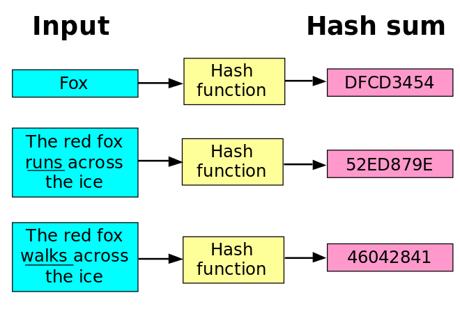

import SimpleHash from "./components/hash/simple_hash.jsx"
import SimpleProofOfWork from "./components/hash/simple_proof_of_work.jsx"
import AdvanceProofOfWork from "./components/hash/advance_proof_of_work.jsx"

# Hash Function

## 什么是hash
有很多的Hash function，简单的可以理解是Hash 可以把任何的东西转换成一串长度更短的字符串。
我们可以通过下面的例子看到，左边的输入可以是很长的，也可以是很短的句子，但是右边生成出来的结果
都是差不多构造的。

下面这个例子就可以带你见识一下如何使用这个Hash功能。

<SimpleHash />

## Proof of Work

我们可以简单的理解就是通过大量的计算达到某一个结果，这其中的工作量的多少就取决于这个问题的难度。譬如我们想要找到一个
`输入数值`使其经过`Hash`过的输出末尾有`x`个连续的0。这个问题很简单，我们只需要不断的尝试就可以达到，但是这个问题的难度
也会随着`x`的变大越来越难。举例，找到结尾有1个连续的0的输入要远比找到10个连续的0要简单。下面的这个简单的例子会采用`sha256`
作为Hash函数，之后你可以通过调整上面的难度来看所需要的计算时间。

> 这同时也很形象的说明了区块链的核心思想，去寻找一个结果很难，但是证明结果的正确性很简单。毕竟看结果是不是开头有这么多个0，
只需要一秒钟，但是要找到这个答案却需要很长时间。

<SimpleProofOfWork />

当然这个毕竟是基础版本，所以还有很多的不足的地方，譬如不够智能，当难度过高的时候就会出现一直找不到正确的结果。当然我们
现在已经有的区块链产品可没有这么的不智能，他们都会自己调整难度，如果一直找不到结果的话，就会自动降低难度。下面的
这个例子就很形象的阐述了这个过程。

<AdvanceProofOfWork step={20}/>

